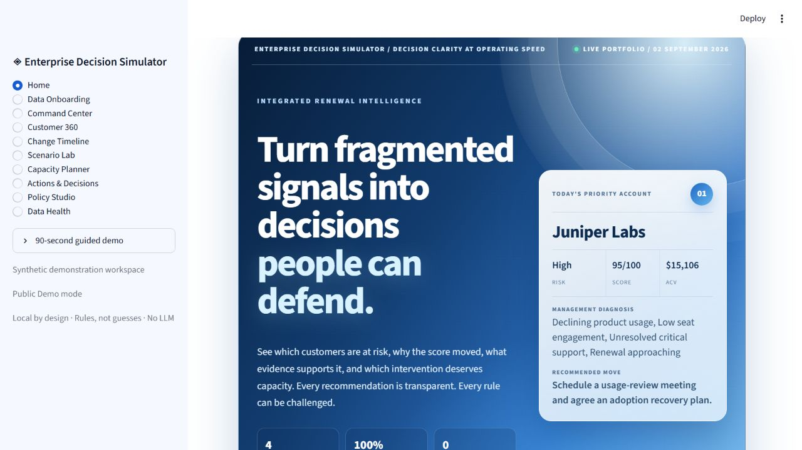
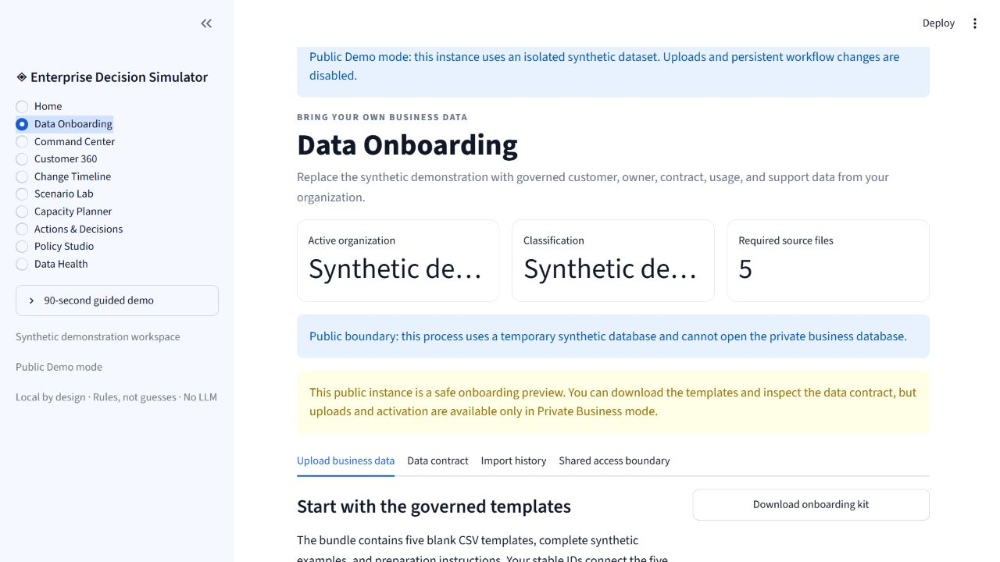
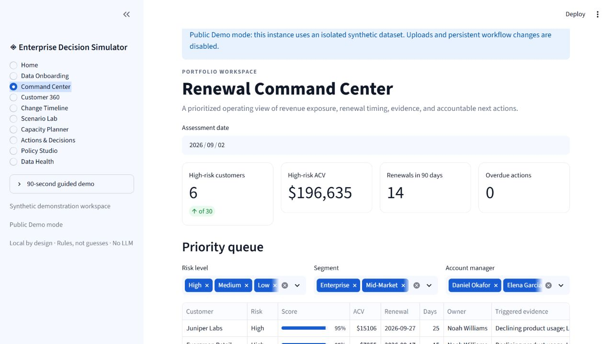
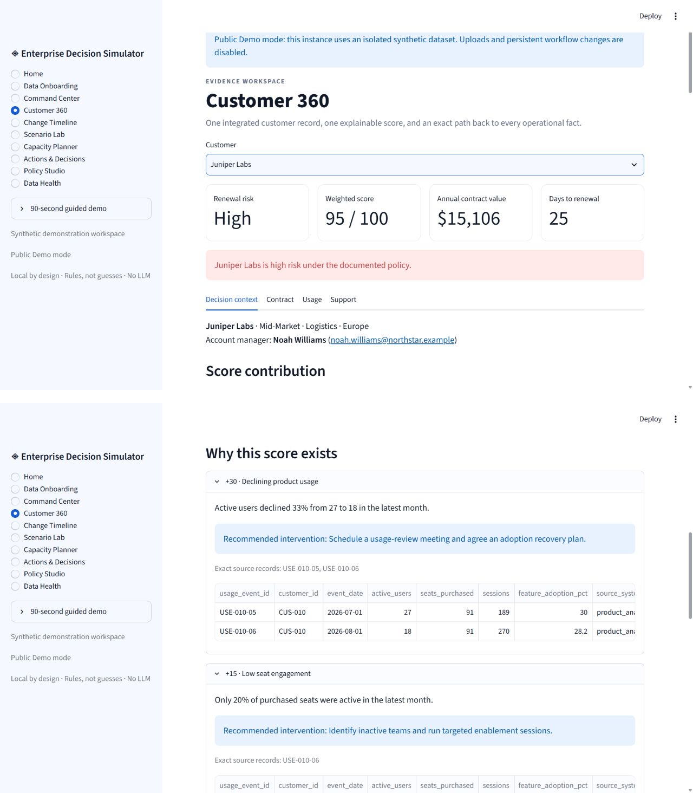
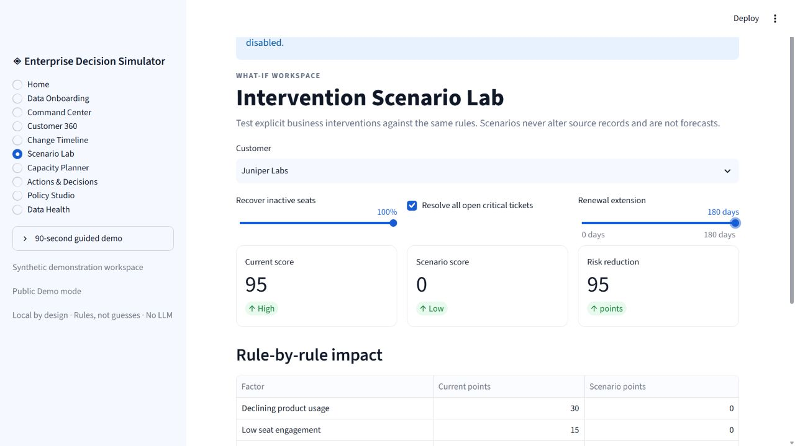
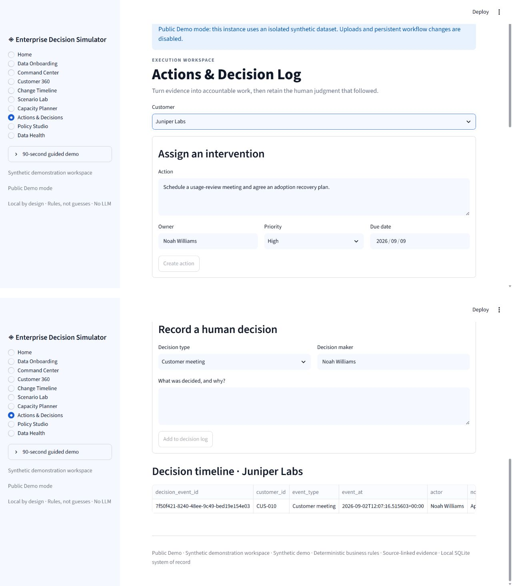
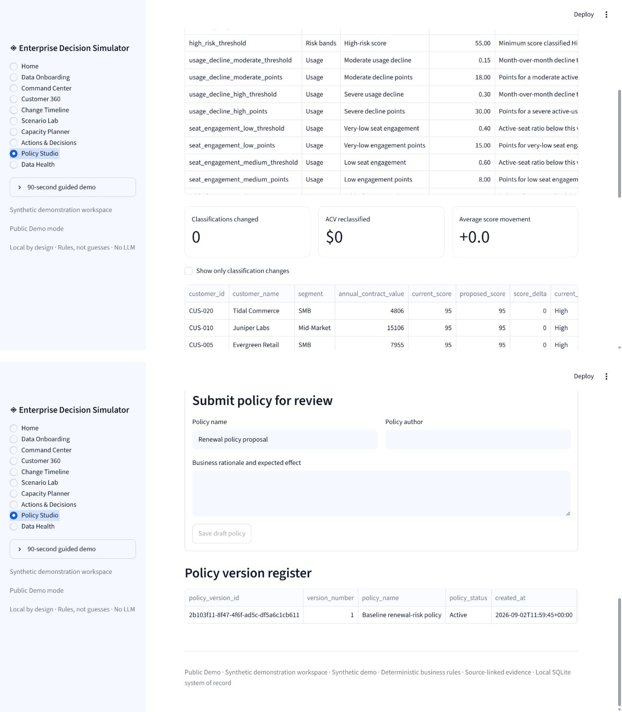
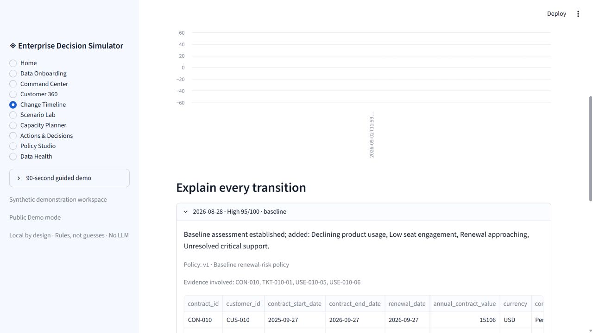
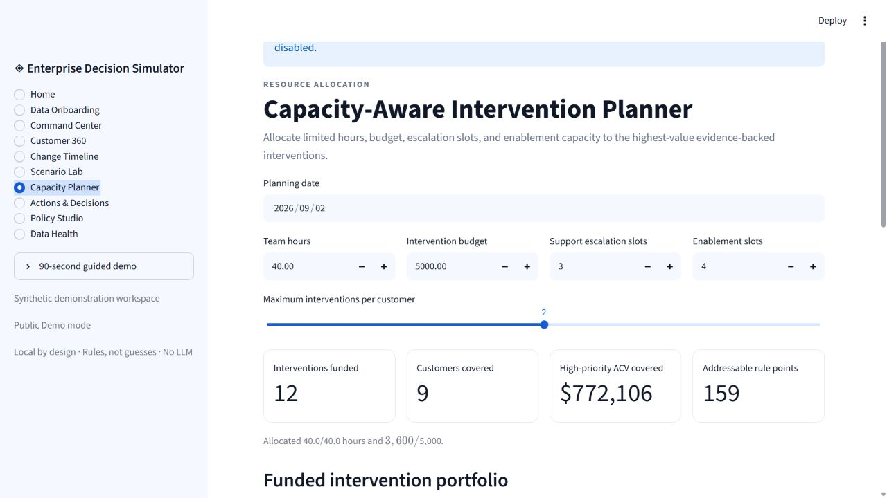

# Enterprise Decision Simulator

Hi I'm Sanvid and I created this local-first renewal command center for a fictional enterprise SaaS company, which integrates CRM, contract, product-usage, and support data to answer:

> Which customers are least likely to renew, what exact evidence explains the risk, and what should the account team do next?

This is a decision-support system, not an AI wrapper. Every score is produced by documented business rules, every reason links to source records, and every intervention can be tested without an LLM, paid API, model download, cloud account, or Docker.

The repository supports two enforced deployment modes. **Public Demo** is the secure default: synthetic, isolated, and read-only. **Private Business** is an explicit local opt-in that enables governed uploads and persistent workflow decisions.

## Platform capabilities

- **Executive Home:** a real product landing page with live portfolio pulse, highest-priority briefing, system readiness, guided decision journeys, and direct workspace navigation.
- **Two enforced deployment modes:** publish a safe synthetic demonstration or run an authorized persistent business workspace from the same repository.
- **Business Data Onboarding:** download a governed five-file template kit, upload an organization's customer data, inspect profiles and source previews, pass validation, approve warnings, and activate the dataset locally.
- **Versioned Policy Studio:** edit every threshold and weight, replay the entire portfolio, quantify reclassified ACV, and require independent maker-checker approval before activation.
- **Risk Change Timeline:** explain score movement through factors added, removed, or reweighted, then place it beside product, support, contract, scenario, action, and human-decision events.
- **Capacity-Aware Intervention Planner:** allocate limited hours, budget, support escalations, and enablement slots with a documented deterministic priority formula; retain both funded and deferred work.

- **Portfolio command center:** rank 30 accounts by renewal risk, timing, ACV, owner, and required action.
- **Evidence-first Customer 360:** drill from score → factor → exact contract, usage, or support rows.
- **Deterministic Scenario Lab:** test usage recovery, critical-ticket resolution, and renewal extensions without changing source data.
- **Action and decision workflow:** assign owners and due dates, update execution status, and retain a human decision log.
- **Historical snapshots:** persist point-in-time scores and factor results rather than silently recalculating history.
- **Governed bring-your-own-data flow:** validate five CSVs before incremental, checksum-aware ingestion.
- **Executive exports:** download a working CSV queue or a self-contained, print-friendly HTML brief.
- **One-command bootstrap:** generate the same synthetic dataset, build SQLite, ingest it, and snapshot the portfolio.

## Quick start

Requires Python 3.11+ and Git. The repository stays comfortably below 500 MB; generated CSVs and SQLite files remain local and are ignored by Git.

```bash
git clone https://github.com/sanvidvaidya/enterprise-decision-intelligence-simulator.git
cd enterprise-decision-intelligence-simulator
python -m venv .venv
```

Activate the environment:

```powershell
# Windows PowerShell
.\.venv\Scripts\Activate.ps1
```

```bash
# macOS/Linux
source .venv/bin/activate
```

Install and launch the secure public demonstration locally:

```powershell
python -m pip install -r requirements.txt
python -m streamlit run streamlit_app.py
```

No environment variable is required. The safe default creates a temporary synthetic database, disables uploads and persistent changes, and discards that database when the process is replaced.

To run an authorized private business workspace on Windows PowerShell:

```powershell
$env:EDS_DEPLOYMENT_MODE = "private_business"
$env:PYTHONPATH = "$PWD\src"
python -m decision_intelligence.bootstrap
python -m streamlit run streamlit_app.py
```

On macOS or Linux:

```bash
export PYTHONPATH="$PWD/src"
export EDS_DEPLOYMENT_MODE="private_business"
python -m decision_intelligence.bootstrap
python -m streamlit run streamlit_app.py
```

Open the local URL printed by Streamlit. No account or internet connection is required after dependencies are installed.

## Use your own business data

Start the application in **Private Business** mode, then open **Data Onboarding** from the sidebar and download the onboarding kit. It contains blank CSV templates, complete synthetic examples, preparation instructions, and the exact five-file contract for account managers, customers, contracts, monthly product usage, and support tickets.

Upload all five completed files together. The application profiles the extracts, previews source records, validates their structure and relationships, records checksums and quality results, and asks for explicit confirmation before changing the active local dataset. A successful import registers the organization name, data steward, classification, source counts, and ingestion run ID.

Uploads remain on the machine running Streamlit and are stored in its local SQLite database. This is suitable for a private laptop or approved internal server. It is not a public multi-tenant service. Do not expose the local Streamlit server directly to the internet or upload data you are not authorized to use. See [Business data onboarding](docs/BUSINESS_ONBOARDING.md) for the data contract and the controls required before shared deployment.

## Publish the free public demo

The repository is ready for Streamlit Community Cloud. Create a free app from the GitHub repository, select `streamlit_app.py` as the entrypoint, and leave `EDS_DEPLOYMENT_MODE` unset. The safe default ensures that the hosted instance uses synthetic data and blocks all persistent operations. Streamlit documents Community Cloud as a free platform for personal and educational apps, although resource limits, hibernation, and service terms can change. See [Deployment modes](docs/DEPLOYMENT_MODES.md) for the complete procedure and capability matrix.

## Verify the system

In a second terminal, activate the same virtual environment, enter the repository, and run:

```bash
python -m pytest
```

The suite verifies validation, relational integrity, risk boundaries, source evidence, simulations, snapshots, policy governance, temporal explanations, constrained allocation, workflow auditing, and reports. GitHub Actions repeats generation, ingestion, and tests across Windows and Linux on Python 3.12 and 3.14 for every push and pull request.

## System tour

| Workspace | Decision supported |
| --- | --- |
| Home | What is this system, what needs attention now, and where should I begin? |
| Data Onboarding | How can an organization validate, activate, classify, and trace its own five-domain dataset? |
| Command Center | Where should leadership focus time and renewal resources? |
| Customer 360 | Why does this account have this score, and which records prove it? |
| Change Timeline | What changed, when did it change, and which evidence or policy caused it? |
| Scenario Lab | Which explicit intervention would change the rule-based outcome? |
| Capacity Planner | Which interventions fit this week's real resource constraints? |
| Actions & Decisions | Who owns the response, by when, and what did humans decide? |
| Policy Studio | What portfolio impact would a rule change create, and who approved it? |
| Data Health | Can the source data be trusted, traced, and safely loaded? |

## Sample questions

- How much annual contract value is currently exposed to high renewal risk?
- Which customers combine an approaching renewal with unresolved critical support?
- Which source rows contributed each point to a customer's score?
- Would restoring seat engagement move this account below the escalation threshold?
- Which interventions are overdue, blocked, or completed?
- Which source files changed during the latest ingestion?
- Which customers changed risk band after a proposed policy update?
- Why did this customer's score move between two stored assessments?
- With 40 hours and three escalation slots, which interventions should be funded?

## Documentation

- [Architecture](docs/ARCHITECTURE.md)
- [Business data onboarding](docs/BUSINESS_ONBOARDING.md)
- [Deployment modes](docs/DEPLOYMENT_MODES.md)
- [Data model](docs/DATA_MODEL.md)
- [Ingestion and data quality](docs/INGESTION_AND_DATA_QUALITY.md)
- [Risk and scenario methodology](docs/METHODOLOGY.md)
- [Limitations](docs/LIMITATIONS.md)
- [90-second demo script](docs/DEMO_SCRIPT.md)

## Screenshots

These frames were captured from the public demo using synthetic data only.

### Executive Home



_Live portfolio pulse, today's priority account, and the governed decision path._

### Data Onboarding



_Public-boundary preview of the five-file onboarding kit and validation contract._

### Command Center



_Portfolio KPIs and the evidence-backed renewal priority queue._

### Customer 360



_Score contribution waterfall paired with expanded, source-linked usage evidence._

### Scenario Lab



_Current versus simulated score after explicit adoption, support, and renewal assumptions._

### Actions & Decisions



_Assigned intervention context and the human decision timeline for Juniper Labs._

### Policy Studio



_Portfolio impact preview alongside the maker-checker policy version register._

### Change Timeline



_Factor-level score movement with the exact contract, usage, and support evidence involved._

### Capacity Planner



_Funded intervention portfolio under explicit hours, budget, escalation, and enablement limits._

## Future AI integration without weakening governance

An optional future LLM could consume a read-only structured context containing customer facts, factor results, evidence IDs, approved actions, and scenario assumptions. SQLite and the deterministic engine would remain the systems of record. The model could draft meeting briefs or summarize evidence, but it would not invent risk factors, overwrite source facts, or silently change scores. Human approval, prompt/output logging, access control, and evaluation would be required before any production use.

## License

MIT. See [LICENSE](LICENSE).
