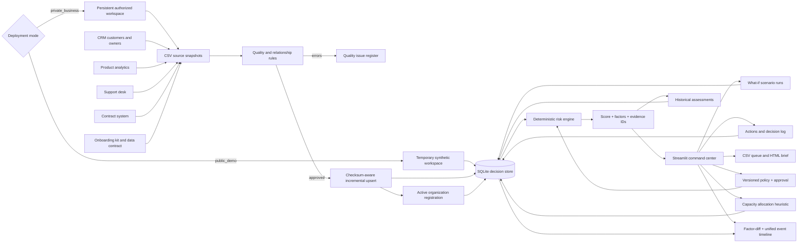

# Architecture

## Purpose

The simulator is a closed-loop information system: it turns multi-system operational records into governed decisions, captures human follow-through, and preserves the evidence needed to review both.

## Logical architecture

## Information flow

1. The application starts with five reproducible synthetic extracts. A business can download the same data contract and replace them with its authorized source snapshots.
2. Data Onboarding profiles uploaded files and previews source rows before any operational change.
3. Validation checks structure, required files, minimum source populations, required values, domains, numeric ranges, dates, duplicates, and cross-system relationships.
4. SHA-256 manifests identify which source snapshots changed. Only changed tables are upserted; stale rows in those snapshots are removed in dependency-safe order.
5. A successful run activates a locally registered organization, steward, classification, source count, row count, and ingestion run.
6. SQLite integrates operational facts and records ingestion lineage.
7. The active versioned policy supplies every threshold, weight, renewal window, and risk band to the risk engine.
8. Draft policy is replayed against the portfolio before a separate reviewer can activate it.
9. The risk engine returns a score, band, factor contributions, evidence IDs, and recommended interventions.
10. Factor-level snapshot differences explain temporal movement; a unified timeline combines system observations and human decisions.
11. The capacity planner ranks addressable interventions and enforces hours, budget, support, and enablement constraints.
12. Historical assessments, policies, scenarios, plans, actions, and decisions remain distinct from source facts.

## Trust boundaries

- Missing deployment configuration defaults to Public Demo. Unknown values stop startup.
- Public Demo creates an isolated temporary database and never opens the private operational database.
- Public Demo disables uploads and persistent workflow, policy, scenario, snapshot, and allocation writes.
- Persistent operations check the active mode immediately before execution.
- Uploaded data cannot reach operational tables until validation passes.
- Activating a dataset requires an organization name, data steward, classification, and explicit replacement confirmation.
- Warning-level exceptions require explicit approval and are recorded.
- Scenarios are saved as hypotheses and never mutate usage, ticket, or contract records.
- Policy drafts cannot become active without an approval identity different from the author.
- Allocation records retain deferred candidates and their constraint reasons, not only the selected answer.
- Recommendations are deterministic prompts; a human owns execution and can record a different decision.
- The application is local and has no runtime API, model, telemetry, or cloud dependency.

## Deployment boundary

Public Demo can be hosted for portfolio access because it is synthetic, disposable, and read-only. Private Business remains a single-workspace local application. It does not provide identity, tenant isolation, HTTPS termination, encrypted secret management, production backups, or high-concurrency controls. A worldwide shared service containing real business data would place a secure application gateway and identity provider in front of the interface, replace SQLite with a production database, isolate each tenant, encrypt transport and storage, and add audit monitoring, retention, recovery, and incident-response controls.

## Why these design choices matter

SQLite supplies transactions, constraints, SQL, and portability without an infrastructure burden. A normalized operational model avoids update anomalies. Derived decision tables preserve reproducible snapshots without duplicating or rewriting source facts. Streamlit keeps the demonstration accessible while the service modules remain independently testable.
