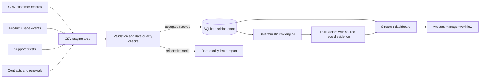

# Architecture

## Purpose

This project is a local decision-support system for renewal-risk workflows. It combines operational data from four systems—CRM, product telemetry, support, and contracts—into a single, explainable customer view.

## Logical architecture

## Information flow

1. Each fictional source system produces a stable CSV extract with a source-specific primary key.
2. The ingestion process validates type, required-field, uniqueness, and referential-integrity rules before loading accepted rows into SQLite.
3. SQLite is the integrated operational data store. Its normalized tables retain source IDs so analytical conclusions remain traceable.
4. The risk engine reads the integrated records and returns factor-level evidence: factor name, score contribution, explanation, and supporting source record identifiers.
5. Streamlit presents the customer, the score, and the evidence together.

## Component responsibilities

| Component | Responsibility | Design rationale |
| --- | --- | --- |
| `data/raw/` | Versionable or generated source extracts | Separates source representations from integrated records. |
| Validation/ingestion module | Enforces data-quality rules and loads SQLite | Makes integration repeatable and observable. |
| SQLite database | Stores normalized entities and relationships | Portable, zero-server, and sufficient for a compact portfolio project. |
| Risk engine | Computes weighted, deterministic renewal risk | Supports explainability and simple policy changes. |
| Evidence layer | Connects factors to source rows | Provides provenance for recommendations. |
| Streamlit app | Supports account-manager decisions | Keeps the presentation local and easy to demonstrate. |

## Key design choices

### SQLite rather than a cloud database

SQLite keeps the project self-contained, reproducible, and small. It has relational constraints and SQL query support without requiring a service account or network connection.

### Normalized operational model plus derived decision context

Customers, account managers, contracts, usage events, and tickets will be stored as separate related entities. The risk engine will create a derived, customer-level decision context rather than duplicating operational data. This avoids update anomalies while making the dashboard fast and clear.

### Deterministic scoring rather than machine learning

The score will be a documented sum of weighted factors. Every contribution will include the records and thresholds that produced it. That makes it testable, auditable, and appropriate for demonstrating information-systems judgment.

## Planned delivery boundaries

- The project models a fictional company and synthetic data only.
- It runs locally and uses no paid API, LLM, cloud service, Docker dependency, or downloaded model.
- The local SQLite file and generated data are ignored by Git; code and deterministic generation logic will be committed.