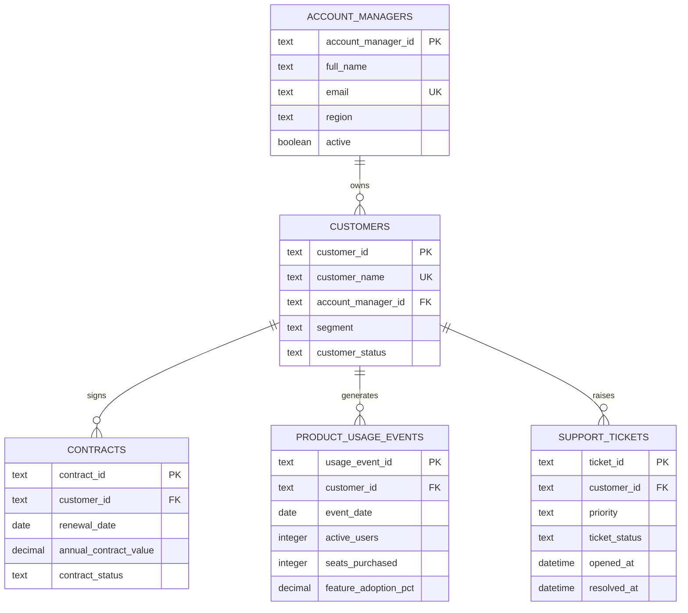

# Data Model

## Purpose

The decision-support system integrates five normalized entities. Each operational record retains its source-system identity, allowing later risk findings to identify the exact customer, usage event, contract, or ticket that supports them.

## Entity relationship diagram

## Tables and business meaning

| Table | Grain | Purpose |
| --- | --- | --- |
| `account_managers` | One row per employee account owner | Supports accountability, territory analysis, and recommended-action routing. |
| `customers` | One row per customer organization | Provides the shared enterprise customer key used to integrate all systems. |
| `contracts` | One row per customer contract | Stores renewal timing, value, and renewal status. |
| `product_usage_events` | One row per customer per monthly observation | Supplies the time series needed to assess adoption and engagement trends. |
| `support_tickets` | One row per support request | Captures unresolved work, severity, and service experience. |

## Integrity and provenance rules

- Text IDs are stable, human-readable business keys (for example, `CUS-001` and `TKT-005-01`).
- Every contract, usage event, and ticket must reference an existing customer.
- Every customer must reference an existing account manager.
- Database `CHECK` constraints reject invalid segments, statuses, negative quantities, invalid percentages, and invalid support priorities.
- A customer can have only one usage observation per event date.
- `source_system` fields preserve where operational facts originated: `product_analytics` or `support_desk`.

## Synthetic source extracts

The deterministic generator creates these files in `data/raw/`:

| File | Fictional source system | Rows |
| --- | --- | --- |
| `account_managers.csv` | CRM | 5 |
| `customers.csv` | CRM | 30 |
| `contracts.csv` | Contract management | 30 |
| `product_usage_events.csv` | Product analytics | 180 (six months per customer) |
| `support_tickets.csv` | Support desk | Variable by customer profile |

The generator uses a fixed random seed and reference date. Running it again produces the same dataset, which is essential for reproducible demonstrations and test results.
## Ingestion audit tables

`ingestion_runs` records when each integration attempt started and finished, its outcome, its source directory, and received/loaded/rejected counts. `data_quality_issues` stores factor-independent data-quality evidence for failed validation runs. These tables keep quality governance separate from operational customer facts.