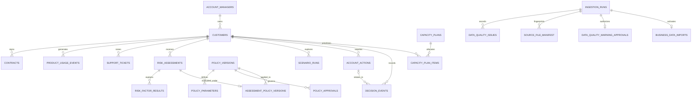

# Data Model

## Entity relationship diagram

## Operational layer

| Table | Grain | Business meaning |
| --- | --- | --- |
| `account_managers` | One row per account owner | Organizational accountability and territory. |
| `customers` | One row per company | Shared enterprise key across systems. |
| `contracts` | One row per customer contract | Renewal timing, commercial value, and terms. |
| `product_usage_events` | One monthly customer observation | Adoption, engagement, and usage trend. |
| `support_tickets` | One support request | Service severity, state, experience, and resolution. |

## Decision layer

| Table | Grain | Business meaning |
| --- | --- | --- |
| `risk_assessments` | One customer at one decision time | Immutable score, band, and as-of date. |
| `risk_factor_results` | One triggered rule in an assessment | Points, explanation, evidence IDs, and action. |
| `scenario_runs` | One saved set of hypothetical assumptions | Baseline and simulated outcome without source mutation. |
| `account_actions` | One assigned intervention | Owner, priority, due date, status, and linked evidence. |
| `decision_events` | One human decision or meeting event | Actor, timestamp, rationale, and optional action link. |
| `capacity_plans` | One saved portfolio allocation | Resource constraints, utilization, owner, policy, and covered ACV. |
| `capacity_plan_items` | One selected or deferred candidate | Rank, effort, cost, addressable points, evidence, and deferral reason. |

## Governance layer

`ingestion_runs` records every integration attempt. `data_quality_issues` retains row-level errors and warnings. `source_file_manifest` stores file SHA-256 and row counts. `data_quality_warning_approvals` records who authorized a warning-level exception. `business_data_imports` registers the organization, steward, classification, counts, and completed ingestion behind the active local workspace. A partial unique index permits only one active business dataset.

`policy_versions` and `policy_parameters` preserve complete business-rule configurations. `policy_approvals` supplies maker-checker evidence. `assessment_policy_versions` identifies the exact policy used by each historical assessment.

## Integrity and provenance

- Stable human-readable IDs such as `CUS-005`, `USE-005-06`, and `TKT-005-01` enable direct evidence lookup.
- Foreign keys enforce ownership and prevent orphaned contracts, events, tickets, and workflow records.
- `CHECK` constraints reject invalid statuses, priorities, segments, percentages, and negative quantities.
- `evidence_record_ids_json` retains the exact operational keys that justified a factor or action.
- Source facts, derived assessments, hypothetical scenarios, and human decisions live in distinct tables because they represent different kinds of organizational truth.
