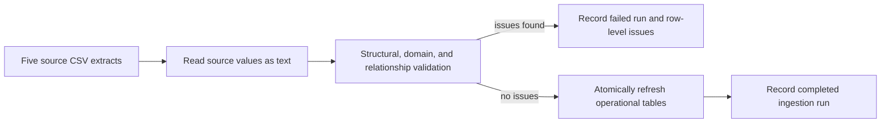

# Ingestion and Data Quality

## Workflow

## Validation rules

The validation module checks:

- required files, columns, and non-blank business identifiers;
- duplicate primary identifiers within an extract;
- allowed business values such as ticket priority, customer segment, and contract status;
- numeric ranges such as positive ACV, 0–100 feature adoption, and 1–5 CSAT;
- valid dates and timestamps; and
- cross-system references between customers, account managers, contracts, usage events, and tickets.

## Failure behavior

The ingestion process is all-or-nothing for the five operational tables. If any error is found, no operational rows are refreshed. Instead, `ingestion_runs` records a `FAILED_VALIDATION` status and `data_quality_issues` captures the source file, row number, record ID, field, rule, message, and raw value.

## Auditability

Successful runs record received and loaded row counts. Failed runs record rejected-issue counts. This creates a basic data-lineage trail that can later be surfaced in the dashboard or reviewed by a data steward.