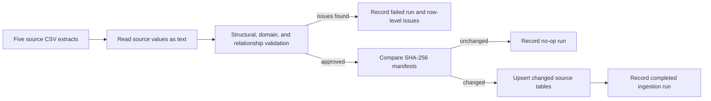

# Ingestion and Data Quality

## Workflow

## Validation rules

The validation module checks:

- required files, columns, and non-blank business identifiers;
- duplicate primary identifiers within an extract;
- allowed business values such as ticket priority, customer segment, and contract status;
- numeric ranges such as positive ACV, 0 to 100 feature adoption, and 1 to 5 CSAT;
- valid dates and timestamps; and
- cross-system references between customers, account managers, contracts, usage events, and tickets.

## Incremental load behavior

Each CSV is a complete snapshot of one source. The loader compares its SHA-256 checksum with the most recent completed manifest. Unchanged files are skipped. Changed files are upserted by stable business key, then rows absent from the changed snapshot are removed in reverse dependency order. The five-file validation gate still runs as one unit so a changed file cannot violate cross-system relationships.

Workflow history is retained for customer IDs that remain present. If the customer snapshot deliberately removes an ID, dependent decision records for that removed customer are cleared before the operational row is removed.

## Failure behavior

The ingestion transaction is all-or-nothing. If any error is found, no operational row is changed. Instead, `ingestion_runs` records `FAILED_VALIDATION` and `data_quality_issues` captures the source file, row number, record ID, field, rule, message, raw value, and severity. Warnings also block by default; an operator may explicitly approve them, in which case both the warning and approval identity are retained.

## Auditability

Successful runs record received and loaded row counts. The manifest records every source filename, row count, and SHA-256 fingerprint. Failed runs record rejected-issue counts. In Private Business mode, the Streamlit **Data Onboarding** workspace supplies the controlled five-file upload path and runs the same validation and ingestion services as the command line. Public Demo exposes the templates and data contract but technically disables the uploader. **Data Health** surfaces ingestion runs, row-level issues, and file manifests after the decision. This separation makes onboarding an operational workflow and keeps audit review focused on evidence.
